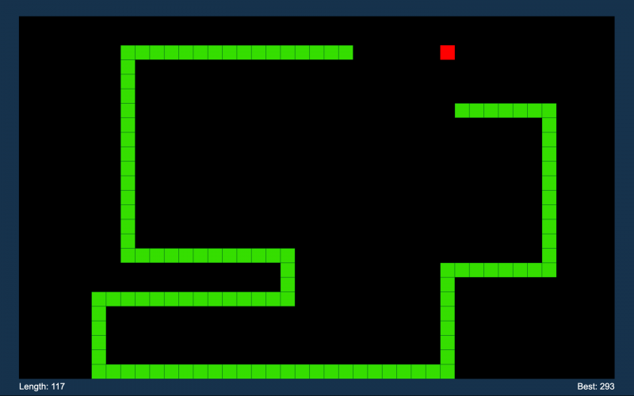

# SNAKE GAME

Implementation of the famous snake game. 
This project allows you to play multiple matches using a Graphical User Interface (GUI). 
Once the game is ended (snake collides with the walls or with his body parts), you can restart the game by pressing teh space key.  

## How to play the game

1. Download the file Snake.py;
2. Open such file in any IDE;
3. RUN the code;
4. Enjoy the game.
